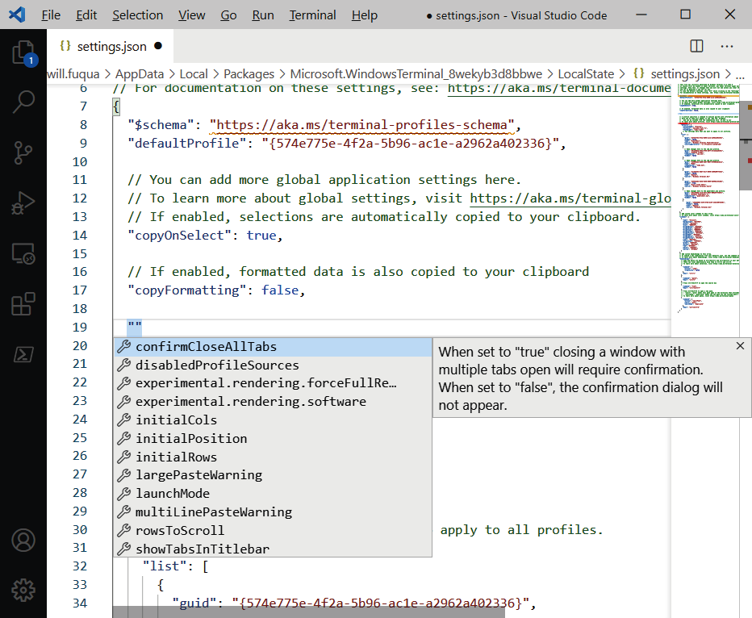
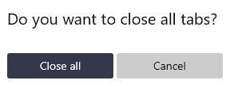
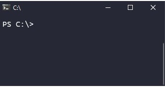
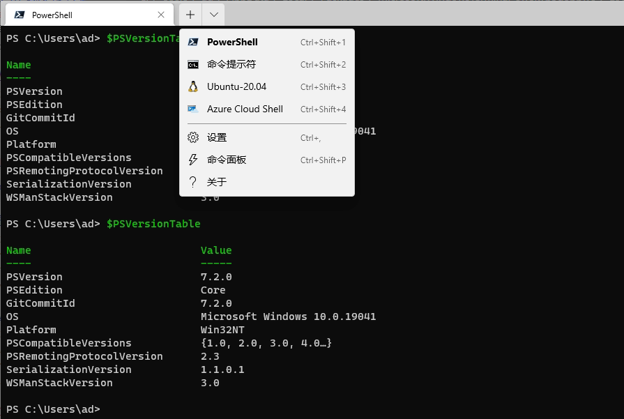
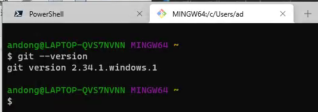
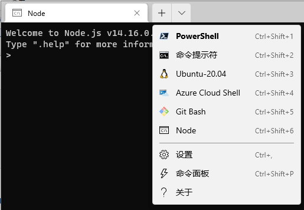
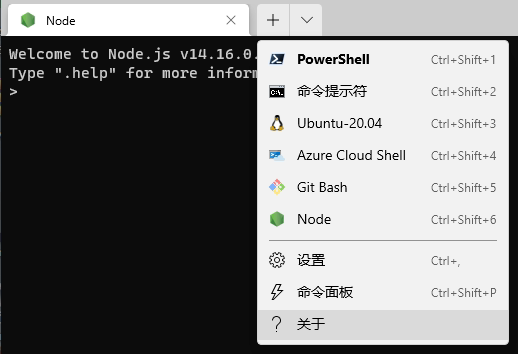

# Chapter 4 Customizing your Windows Terminal settings

## 1. `settings.json` file

Windows Terminal uses a JSON file, named `settings.json`, for its underlying configuration store.


<kbd>Ctrl + Shift + Comma</kbd>: Open `settings.json` file


Choose `Visual Studio Code` as the default editor to make the best of **autocompletion and documentation** in `settings.json`:




Recovering from bad settings

1. Back up current settings file
1. Delete `settings.json`
1. Relaunch Windows Terminal


Default file directory: `C:\Users\{username}\AppData\Local\Packages\Microsoft.WindowsTerminal_8wekyb3d8bbwe\LocalState\`


## 2. Settings file structure

Windows Terminal uses two different settings files: 

- `settings.json`: user settings, 
- `defaults.json`: application's default settings, opened by <kbd>Ctrl + Alt + Comma</kbd>

 The former loaded after the latter one.


File structure:

- **Global settings**
- **Profile settings**
- **Color scheme settings**
- **Keyboard shortcut settings**

```json
{
  // json schema to enable autocomplete and documentation
  "$schema": "https://aka.ms/terminal-profiles-schema",
  // 1. Global settings go at the top of the file.
  // 2. Profile settings go under the "profiles" key.
  "profiles":
  {
    "defaults":
    {
      // settings here apply to all profiles.
    },
    "list":
    [
      // per-profile settings
    ]
  },
  "schemes": [], // 3. Color scheme settings
  "actions":
  [
    // 4. Keyboard shortcut settings
  ]
}
```


## 3. Useful global settings

- `copyOnSelect` option: defaults to `false`, will enable or disable automatically copying text to the clipboard immediately when the text is selected.

- `startOnUserLogin`: default to `false`, dealing with launch automation

- `defaultProfile`: specify a default shell

- `confirmCloseAllTabs`: default `true`, will enable or disable the a dialog that shows when closing a window containing multiple tabs

  

- `showTabsInTitlebar`: defaults to `true`, controls whether the tabs render in Windows Terminal's titlebar, or in their own tabstrip beneath the titlebar.

  

- when set to `false`, only via keyboard shortcuts such as <kbd>Ctrl + Shift + space</kbd> and <kbd>Ctrl + Shift + T</kbd>, or via the command palette (<kbd>Ctrl + Shift + P</kbd>) to open new tabs.
- `theme`: three values supported: `light`, `dark`, and `system`


## 4. Useful profile settings

Each profile object has a unique **GUID** (**globally unique identifier**):

```json
// …
"profiles": {
  "defaults": { },
  "list": [
    {
      // Make changes here to the powershell profile.
      "guid": "{61c54bbd-c2c6-5271-96e7-009a87ff44bf}",
      "name": "Windows PowerShell 5",
      "commandline": "powershell.exe",
      "hidden": false
    },
    {
      "guid": "{0caa0dad-35be-5f56-a8ff-afceeeaa6101}",
      "name": "Command Prompt",
      "commandline": "cmd.exe",
      "hidden": false
    },
    {
      "guid": "{2c4de342-38b7-51cf-b940-2309a097f518}",
      "hidden": false,
      "name": "Ubuntu",
      "source": "Windows.Terminal.Wsl"
    }
  ]
}
// ...
```

However, this `guid` field is actually **optional**! If a GUID is not specified, Windows Terminal **will generate one** for us behind the scenes.

The `defaultProfile` field also accepts a profile's name, for example, `"Windows PowerShell 5"` or `"Ubuntu"`.


Download latest Powershell 7.2.0: https://github.com/PowerShell/PowerShell/releases

Then set new `Powershell` as default and hidden `Powershell 5.x`:

```json
{
    "guid": "{574e775e-4f2a-5b96-ac1e-a2962a402336}",
    "hidden": false,
    "name": "PowerShell",
    "source": "Windows.Terminal.PowershellCore"
},
{
    "commandline": "powershell.exe",
    "guid": "{61c54bbd-c2c6-5271-96e7-009a87ff44bf}",
    "hidden": true,
    "name": "Windows PowerShell"
},
```

Just like this:




> **About the `commandline` and `source` settings in one profile item**
>
> - `commandline`: points to a binary to be executed (for example, `powershell.exe` or `cmd.exe`), and is the one we'll use the most often
> - `source`: a reference to a **dynamic profile generator**, which is used to autopopulate the drop-down menu with available shell (i.e. `WSL2`) distributions. It's currently **not configurable**.


 `startingDirectory`: Controls the current working directory when the shell is launched. Setting this to the environment variable, `%USERPROFILE%`, will default the shell to the `C:\Users\{USERNAME}` directory.


`hidden`: Controls whether or not the shell appears in the drop-down menu.


## 5. Custom command-line profiles

Windows Terminal's profiles are powerful—we can use **any arbitrary program** as our shell. Usually, these programs are interactive, but it's **not a requirement**.


## Integrating Git Bash shell

```json
{
    "guid": "{f742cfe1-fa88-4d36-bb67-ac93b526bb80}",
    "name": "Git Bash",
    "commandline": "C:\\Git\\bin\\bash.exe -li",
    "startingDirectory": "%USERPROFILE%",
    "icon": "C:\\Git\\mingw64\\share\\git\\git-for-windows.ico"
}
```




## Integrating Node.js interactive shell

```json
{
    "guid": "{5a515080-2f71-46ee-82a8-12e58c384ff3}",
    "name": "Node",
    "commandline": "C:\\nodejs\\node.exe"
}
```



However, `Node.js` does not ship with an easily accessible icon file. However, it's easy to extract the icon file from `node.exe` with the following PowerShell snippet:

```powershell
$exe = "$env:C:\nodejs\node.exe"
$output = "$Home\Desktop\node.png"
$icon = [System.Drawing.Icon]::ExtractAssociatedIcon($exe)
$icon.ToBitmap().Save($output)
```

Then copy the icon file to the node.exe folder, and then reference to the "icon" key: 

```json
{
    "guid": "{5a515080-2f71-46ee-82a8-12e58c384ff3}",
    "name": "Node",
    "commandline": "C:\\nodejs\\node.exe",
    "icon": "C:\\nodejs\\node.png"
}
```



This particular `Node.js` icon can also be downloaded from this book's repository mentioned in the beginning of the chapter; but the PowerShell approach can be used to extract icons from any executable.


## C# interactive shell (skip)

## Vim terminal shell (skip)

## SSH shell (skip)

