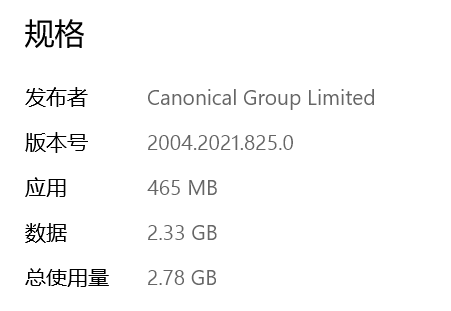
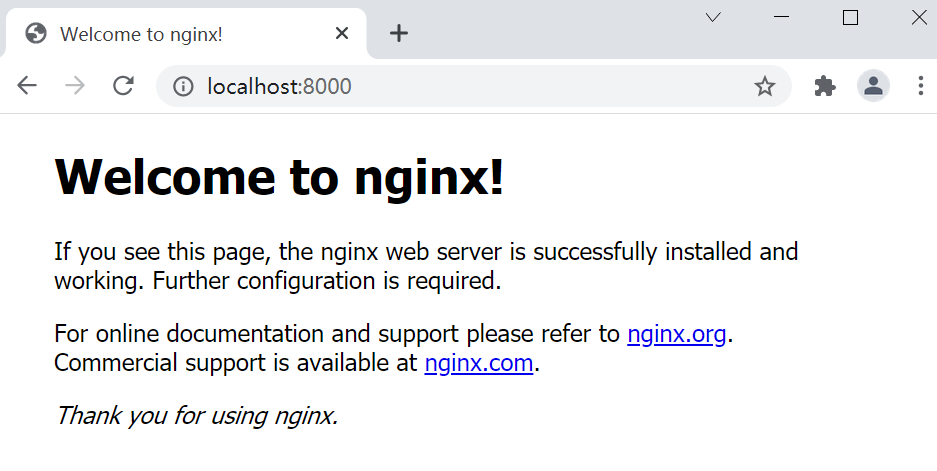
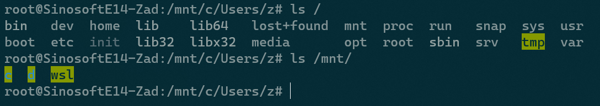
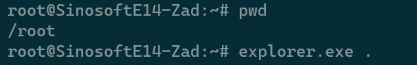
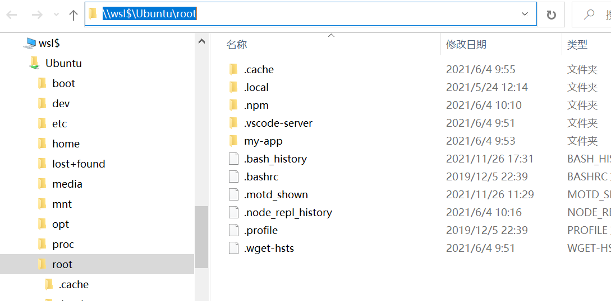
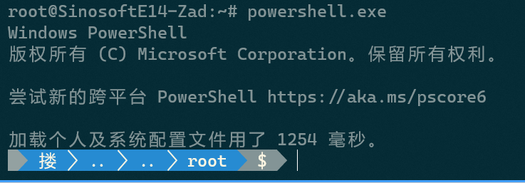

# Section 1 Introduction

## Ch01 Getting started with the new Windows Terminal

> **terminal** vs **shell**
>
> - **terminal**: is essentially "what you see" when using the command line
> - **shell**: doesn't have a UI; it's a command-line program. require a terminal to collect input and display output
> - `cmd.exe` and `powershell.exe` will implicitly start the `conhost.exe` terminal


New features of Windows Terminal:

- modern UI (acrylic effect, Cascadia Code font, Powerline glyphs etc.)
- flexible JSON-based customization system
- open source: https://github.com/microsoft/terminal/


Q: How to update Windows Terminal automatically?
A: inside the Microsoft Store app, enable automatic updates by going to **Settings** and select **Update apps automatically**


How to Launch Windows Terminal: Press `wt` + <kbd>enter</kbd> from:

1. Start menu
2. Run dialogue
3. Windows Explorer location bar
4. task bar: <kbd>Win</kbd> + `1`, <kbd>Win</kbd> + `2`, ...
5. right click: `Open in Windows Terminal` option


Open Windows Terminal on full screen: (`-F` flag)

```shell
$ wt -F
```


## Ch02 Learning the Windows Terminal UI

Get rid of <kbd>Ctrl + Tab</kbd>, please. 

Instead, get used to the **terminal tabs**, just like in your Chrome or Firefox browser.


Some useful shortcuts for the **tabs**:

<kbd>Ctrl + Shift + T</kbd>: open a new tab with our default shell

<kbd>Ctrl + Shift + W</kbd>: close the current tab

<kbd>Ctrl + Shift + Space</kbd>: open the new shell dropdown menu. The list would grow automatically, and the following shortcuts would be available: <kbd>Ctrl + Shift + 1</kbd>, <kbd>Ctrl + Shift + 2</kbd>, ...

<kbd>Ctrl + Shift + D</kbd>: open a "duplicate" of the currently active tab

<kbd>Ctrl + Tab</kbd>: navigate to the next tab

<kbd>Ctrl + Shift + Tab</kbd>: navigate back

<kbd>Ctrl + Alt + [1-9]</kbd>: activate the tab at that index

Besides, Tabs also support **drag-and-drop reordering**


> **Set tab color**: 
>
> Right-click on a tab and select `Color…` to open a color picker


Some useful shortcuts for the **panes**:

- <kbd>Alt</kbd> + clicking the plus button: open the default shell in a new pane
- <kbd>Alt</kbd> + selecting a shell from the new shell dropdown menu: open that shell in a new pane.
- <kbd>Alt + Shift + D</kbd>: duplicate the current shell into a new pane (while new tabs are opened by <kbd>Ctrl</kbd>)
- <kbd>Alt + Shift + Minus</kbd>: open a new default shell horizontally (create a **horizontal border**)
- <kbd>Alt + Shift + Equals</kbd>: open a new pane vertically (create a **vertical border**)
- <kbd>Alt + Arrow</kbd>: (the `Up`, `Down`, `Left`, or `Right` arrows) will switch to the pane in the direction of the arrow key, and any pane can be clicked with the mouse to activate it.
- <kbd>Alt + Shift + Arrow</kbd>: resize the active pane in that direction
- <kbd>Ctrl + Shift + W</kbd>: close a pane


Shortcuts for Terminal **output management**:

- <kbd>Ctrl + Shift + F</kbd>: open the search bar, while you may use `findstr` in the command prompt, `Select-String` in PowerShell, or `grep` on Linux/Unix shells
  - Subsequent presses of <kbd>Enter</kbd>: find subsequent occurrences of the search term
  - <kbd>Shift + Enter</kbd>: reverse the search direction
- <kbd>Ctrl + Shift + C</kbd>: always copy selected text. If there's no text selected, then nothing happens
- <kbd>Ctrl + C</kbd>: copy text if text is selected; otherwise interrupt the currently running command
- Right-clicking: when text is selected will copy that text
- `copy on select`  supported: default to **false**
- <kbd>Ctrl + V</kbd>: paste
- <kbd>Ctrl + Shift + V</kbd>: paste
- <kbd>Shift + insert</kbd>: paste
- `mouse-based pasting` supported: clicking the right mouse button will paste from the clipboard if no text is selected
- <kbd>Ctrl + Minus</kbd>: zoom out the screen to decrease the font size
- <kbd>Ctrl + Equals</kbd>: zoom in the screen to increase the font size
- <kbd>Ctrl + MouseScrolling</kbd>: scale the font size as desired
- <kbd>Ctrl + Shift + P</kbd>: open the command palette. The best part about the command palette is that it shows the associated keyboard shortcuts for each command
- `multiple-level menus` supported in the Command Palette (with the ">" icon)


## Ch03 Configuring an Ubuntu Linux profile


Installing **Windows Subsystem for Linux, version 2** (**WSL2**)

### technical requirements: 

1. Windows: version 1903+ (by `winver`)
2. ARM64: version 2004+


### Why use WSL2?

- certain tasks are easier on Linux/Unix OS
- smaller third-party don't support both OS
- deep integration with `Win10`
- a fast, lightweight way to run Linux programs on Windows
- not intended for production hosting
- focused on running dev and DevOps tasks on the local computer


> **WSL1** vs **WSL2**
>
> - WSL1: a translation layer between Linux and Windows system calls
> - WSL2: ran a real Linux kernel on Hyper-V virtualization (3 to 5 times faster)


WSL2 is primarily targeted at running command-line applications (`cat`, `ls`, `grep` ...)


### How to Install WSL2

> 1. enable 2 features：
>    1. Virtual Machine Platform
>    2. Windows Subsystem for Linux
> 2. set default version: `wsl --set-default-version 2`
> 3. Install Ubuntu on **Microsoft Store**: use version 20.04
>    
> 4. Set user info: **root**/**root** (**z**/**123456** on Asus PC)
>    1. Run from Powershell: `wsl.exe --user root`
>    2. Change password for user **root**: `passwd root` 
> 5. Bug fixed：
>    1. Q: 参考的对象类型不支持尝试的操作。[已退出进程，代码为 4294967295]
>    2. A: Run windows terminal as Admin: `netsh winsock reset`


### Installing Nginx on WSL2

```bash
# Update Ubuntu
sudo apt update
# install nginx
sudo apt install nginx (press 'y')
# Configuration
sudo nano /etc/nginx/sites-enabled/default
# listen on port: 8000
# Start Nginx service
service nginx start
# Stop Nginx service
service nginx stop
```




### Bidirectional access in Windows and Ubuntu

1. Access Windows files in Ubuntu: disk `C` and `D` are mounted under `/mnt/`:

   

2. Access Ubuntu from Windows: run **Windows Explorer** from inside **WSL2** by typing `explorer.exe`:

   

   

Note the prefix: `\\wsl$\Ubuntu`. If another distribution was installed, like Debian, the prefix would be `\\wsl$\Debian`. This style of path, known as a **universal naming convention** path (**UNC path**)

UNC path is used frequently in Windows to refer to network resources.

Any Windows executable can run from inside Ubuntu, as long as it's suffixed with a `.exe` extension.

For instance, run a Powershell program with `powershell.exe` in WSL2:



